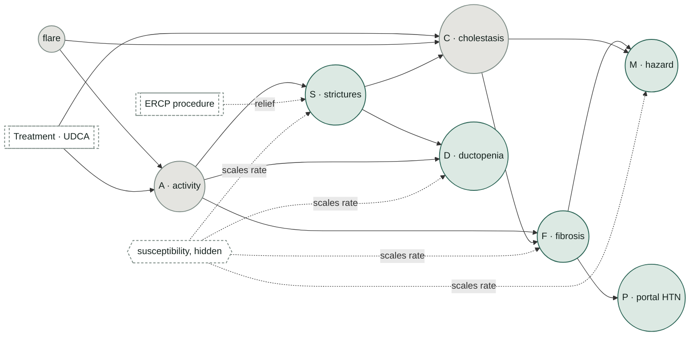
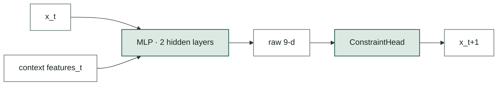
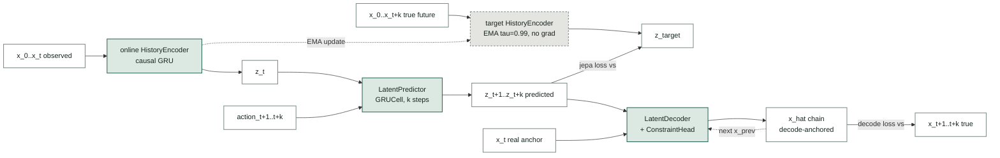

# Digital Liver World Model — take-home submission

**Read `memo.md` first** (the decision memo, the primary deliverable).
`DECISIONS.md` is the full reasoning trail — the core build, two dead
ends, one corrected mistake, and an explainability fix (D1-D9) — plus
three extended lines of investigation beyond the core comparison, each
paired with its own later verification or fix rather than left as a
separate follow-up: a graph-attention encoder (D10), continuous-time
integration tried on both the baseline and TS-JEPA with a split verdict
(D11), and counterfactual validation with a partial fix (D12) —
detailed further in **`EXTENSIONS.md`**.

## Deliverables map

| the assignment asks for | where it is here |
|---|---|
| **Decision memo** (≤3 pages) | `memo.md` |
| **Working prototype** | `models/baseline.py` + `checkpoints/baseline.pt` (delivered); `models/jepa.py` + `checkpoints/jepa.pt` (TS-JEPA, the team's working direction, built and measured, not shipped) |
| **Evaluation harness** | `scripts/eval.py` (baseline harness: accuracy, violations, probes) + `scripts/compare.py` (head-to-head baseline vs JEPA across every axis) + `scripts/verify_claims.py` (recomputes every number cited in the memo) |
| **Generalisation probe** | `data.py`: held-out susceptibility, unseen treatment timing, long rollout (T=90) |
| Explainability, "why decompensation at month 30?" | `scripts/explain.py` → `figures/explain_decompensation.png`, memo Sec. 7 |
| Generator (data + quality bar) | `generator.py` (seeded; self-checks constraints hold) |
| Constraint mechanism | `models/constraints.py` (by-construction), `scripts/test_invariants.py` (proves it under random weights) |
| Optional: noise-robustness experiment | `scripts/jepa_denoise.py` — tested and reported honestly (narrows but does not close the gap; see `DECISIONS.md` D8) |
| **Graph-attention encoder** | `models/graph_encoder.py`, `scripts/train_jepa_graph.py`, `scripts/compare_graph.py` — negative result, see `EXTENSIONS.md` E1 |
| **Modality decoders** | `models/modalities.py`, `scripts/modality_eval.py` — see `EXTENSIONS.md` E2 |
| **Continuous-time Neural-ODE** | `models/neural_ode.py`, `scripts/train_neural_ode.py`, `scripts/compare_ode.py` — modest positive result, see `EXTENSIONS.md` E3 |
| **Counterfactual validation** | `scripts/counterfactual.py` — the most consequential result in the submission, see `EXTENSIONS.md` E4 |

## TL;DR result

The baseline (x(t) as the latent, no history) beats TS-JEPA on every axis
tested — clean accuracy, all three generalisation probes, sensor noise up
to σ=0.25, and stale-visit staleness up to 18 months. Both models hold
**0 constraint violations** in every condition. Full numbers and the two
follow-up experiments that tried (and mostly failed) to close the gap are
in `memo.md` Sec. 5 and `DECISIONS.md` D7-D8.

| axis | baseline | TS-JEPA |
|---|---|---|
| Clean, in-distribution (K=24) | **0.0246** | 0.0291 |
| Held-out susceptibility | **0.0791** | 0.0807 |
| Unseen treatment timing | **0.0363** | 0.0398 |
| Long rollout (T=90, K=55) | **0.0775** | 0.1174 |
| Sensor noise σ=0.25 (8-seed mean) | **0.129** | 0.130 (denoise-aug) |

(ratchet MAE — mean absolute error on the 5 constrained channels F,D,S,P,M)

**Counterfactual validation (`EXTENSIONS.md`, `scripts/counterfactual.py`):** a
probe (matched generator re-runs under a shifted treatment start) found
the baseline tracks the true causal direction of a treatment intervention
reliably (correlation 0.85-0.90 across 3 shift sizes) while TS-JEPA's
implied effect does not (correlation −0.18 to −0.28) — a second,
independent line of evidence for the same conclusion.

**Follow-up work (`DECISIONS.md` D3, D7, D9, D11-D12):** the baseline's
local attribution turned out to be wrong-signed *systematically*, not
just at one patient — only 13.8%/7.4% of 500 random samples had the
correct sign on `d(F)/dA`, `d(F)/dC`. A sign-only auxiliary loss (D9)
fixes this completely (100%/100%) at a real but modest accuracy cost
(K=24 ratchet MAE 0.0246→0.0259). A susceptibility-free coupling probe
(D3) closes the other open verification gap: both models get the F·C
coupling's *sign* right everywhere, and TS-JEPA's version is exact *by
construction* (its decoder never sees `x_prev` directly). Two further
architectural ideas were tried and reported honestly: folding RK4
integration into TS-JEPA's decoder (D11) made things worse (+25%
ratchet MAE); annealing VICReg once effective rank stabilizes (D7) only
partially recovered the earlier degradation and cost
held-out-susceptibility accuracy in return. A counterfactual-consistency
loss (D12) fixes TS-JEPA's *mean* implied treatment effect and its
same-sign rate (58-65% → 88-94%) but not its per-patient correlation
with the truth, which stays negative.

## Architecture

### Causal structure

Every arrow below is read directly off `generator.py`'s update equations —
edge for edge, it's also the causal mask `models/graph_encoder.py` uses as
an attention prior for the graph-attention encoder (E1).



Solid arrows drive next month's increment. The dashed amber-style edge out
of ERCP is the system's *only* relief mechanism — every other edge only
ever pushes its target up. `susceptibility` (dashed, hexagon) multiplies
the rate of every ratchet field but is never given to either model — it's
the one variable the held-out-susceptibility probe forces a model to
infer from the trajectory itself.

### Baseline vs TS-JEPA

Both models route their raw output through the same `ConstraintHead`, so
any accuracy difference is attributable to the architecture, not to one
model getting an easier guarantee.

**Baseline (`models/baseline.py`) — `x(t)` itself is the latent:**



**TS-JEPA (`models/jepa.py`) — predicts the *representation* of future
states, not raw values:**



The online encoder is graded on predicting z_target — a *representation*
of the true future, produced by an EMA copy of itself — rather than on
reconstructing raw values directly; that decoupling is the actual JEPA
idea. A VICReg variance+covariance term (not pictured — it's a
regulariser on `z_t` across the batch, not a data-flow edge) keeps the
online encoder's latents from collapsing to a constant. The decoder chains
its own previous output back in as `x_prev` (decode-anchor), so the
decoded rollout is an honest free rollout, on the same constraint manifold
as the baseline, at every step.

## Setup

```
pip install torch numpy matplotlib
```

CPU is fine — every model here is a few thousand parameters.

## Run

Runtimes are all seconds to a couple minutes on CPU.

```bash
python scripts/test_invariants.py   # constraint guarantees hold under RANDOM weights (run this first)
python generator.py         # generate data + self-check: 0 violations, sane ranges
python scripts/train_baseline.py    # ~30s -> checkpoints/baseline.pt
python scripts/train_jepa.py        # ~1-2min -> checkpoints/jepa.pt
python scripts/jepa_denoise.py      # ~1-2min, the noise-augmentation experiment -> checkpoints/jepa_denoise.pt
python scripts/eval.py               # baseline: accuracy, violations, all 3 generalisation probes
python scripts/compare.py            # head-to-head baseline vs JEPA, all axes including noise/staleness stress
python scripts/verify_claims.py      # recomputes every number cited in memo.md, with multi-seed checks
python scripts/explain.py            # "why did the model predict this at month 30?" -> figures/explain_decompensation.png
python scripts/figures_showcase.py   # regenerates the memo's summary figures from the saved checkpoints

# graph-attention / modality / Neural-ODE / counterfactual lines (EXTENSIONS.md) -- run after the above
python scripts/train_jepa_graph.py   # ~1-2min, graph-attention encoder -> checkpoints/jepa_graph.pt
python scripts/compare_graph.py      # graph-attention vs plain encoder vs baseline
python -m models.modalities  # modality-decoder sanity check
python scripts/modality_eval.py      # state error translated into clinical units
python scripts/train_neural_ode.py   # ~1min, continuous-time variant -> checkpoints/neural_ode.pt
python scripts/compare_ode.py        # Neural-ODE vs discrete baseline
python scripts/counterfactual.py     # matched-pair counterfactual validation (the most consequential result in the submission)

# follow-up improvements (DECISIONS.md D3, D7, D9, D11-D12) -- run after the above
python scripts/coupling_probe.py            # susceptibility-free F*C coupling-strength probe, no retraining needed
python scripts/train_baseline_jacobian.py   # ~30s, sign-only Jacobian penalty -> checkpoints/baseline_jacobian.pt
python scripts/train_jepa_ode.py            # ~1-2min, RK4 latent-ODE decoder for TS-JEPA -> checkpoints/jepa_ode_decoder.pt
python scripts/train_jepa_anneal.py         # ~4min, D7 replica + VICReg-annealed counterpart -> checkpoints/jepa_150.pt, checkpoints/jepa_anneal.pt
python scripts/train_jepa_counterfactual.py # ~5-8min, counterfactual-consistency loss -> checkpoints/jepa_counterfactual.pt
```

## Files

```
digital_liver/
├── README.md, memo.md, DECISIONS.md, EXTENSIONS.md
├── generator.py, data.py         # the domain model: what a trajectory is
├── models/                       # architectures — no training/eval logic
├── scripts/                      # everything you run: train, evaluate, compare, probe
├── checkpoints/                  # trained weights, one per script that saves one
└── figures/                      # generated plots
```

**Root — the domain model.**

| file | role |
|---|---|
| `generator.py` | seeded synthetic generator; field indices; the coupling structure (M<-F·C, S ratchet+ERCP relief, etc.) |
| `data.py` | deterministic train/val split + the 3 generalisation-probe cohorts |

**`models/` — architectures.**

| file | role |
|---|---|
| `constraints.py` | `ConstraintHead` — the by-construction guarantee, shared by every model below |
| `baseline.py` | `MonotoneStep` — the delivered prototype (x(t)-as-latent) |
| `jepa.py` | `TSJEPA` — encoder/EMA-target/predictor/decode-anchor |
| `graph_encoder.py` | graph-attention encoder variant (E1, negative result) |
| `modalities.py` | fixed modality-rendering functions (E2) |
| `neural_ode.py` | continuous-time RK4 variant of the baseline (E3, modest positive result) |
| `jepa_ode_decoder.py` | RK4 latent-ODE decoder for TS-JEPA (D11, negative result) |

**`scripts/` — training, evaluation, and probes.**

| file | role |
|---|---|
| `test_invariants.py` | proves the constraint guarantees hold for random weights, before training |
| `train_baseline.py`, `train_jepa.py` | training scripts (one-step + annealed multistep; JEPA loss + VICReg + decode-anchor) |
| `jepa_denoise.py` | the noise-augmentation experiment (trained on corrupted input, clean targets) |
| `train_jepa_graph.py`, `train_neural_ode.py` | training scripts for the graph-attention and Neural-ODE extensions |
| `eval.py` | baseline evaluation harness: rollout accuracy, constraint violations, probes |
| `compare.py`, `compare_graph.py`, `compare_ode.py` | head-to-head comparisons across all model variants |
| `modality_eval.py` | translates state-space rollout error into clinical units |
| `counterfactual.py` | matched-pair counterfactual validation (E4) |
| `verify_claims.py` | recomputes every number in the memo, with multi-seed averaging where it matters |
| `explain.py` | gradient-based attribution through the model's own rollout |
| `figures_showcase.py` | regenerates the memo's summary figures |
| `coupling_probe.py` | susceptibility-free F·C coupling-strength probe (D3) |
| `train_baseline_jacobian.py` | baseline + sign-only Jacobian penalty, fixes the wrong-signed attribution (D9) |
| `train_jepa_ode.py` | trains the RK4 latent-ODE decoder above (D11) |
| `train_jepa_anneal.py` | trains the replica control and its VICReg-annealed counterpart (D7, partial/mixed result) |
| `train_jepa_counterfactual.py` | TS-JEPA + counterfactual-consistency loss (D12, partial fix) |

**Documentation & outputs.**

| file | role |
|---|---|
| `memo.md` | the memo (primary deliverable) |
| `DECISIONS.md` | full reasoning trail: dead ends, one corrected mistake, an explainability fix, and three extended lines of investigation each paired with a later verification or fix (D10-D12) |
| `EXTENSIONS.md` | four extended lines of investigation (E1-E4) beyond the core baseline-vs-JEPA comparison |
| `figures/` | all generated plots |
| `checkpoints/` | trained model weights |

Every `scripts/*.py` file resolves `generator`, `data`, and `models.*` regardless of where it's invoked from — run any of them as `python scripts/<name>.py` from the repo root, exactly as in Run above.

## Scope (what is deliberately out)

Genuinely out of scope: validating the graph-attention encoder against
referral-stratified cohorts (the referral-bias-shortcut test the
assignment explicitly scopes as "out of scope for context only"), and any
causal validation beyond the matched-pair generator re-run in
`scripts/counterfactual.py`.

Also not pursued, of the assignment's four "try something new" seeds: a
learned "is-this-state-on-manifold" critic. The constraint mechanism
already makes off-manifold states structurally unreachable, so a
violation-detecting critic has nothing left to catch on that axis — a
critic scoring *plausibility* among technically-valid-but-implausible
trajectories is a different, real idea, and it's untried here (see
`DECISIONS.md` D5).
